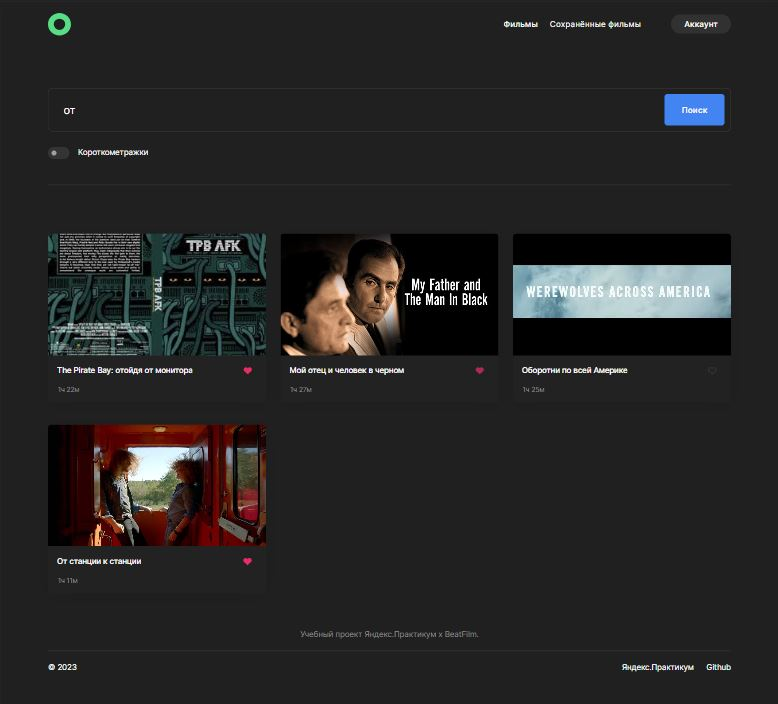

#  Дипломный проект. Курс "Веб-разработчик" от Яндекс.Практикум (frontend)

## [Демонстрация сайта](https://movies.marusillda.nomoreparties.sbs)

Проект представляет собой сервис, в котором можно найти фильмы по запросу и сохранить в личном кабинете.

Макет в Figma по [ссылке:](https://disk.yandex.ru/d/rCWxnXTRqKTiTg)

**Выполнена фронтенд часть проекта, в которой реализованы:** 
* вёрстка компонентов на React;
* логика и вёрстка главной страницы, страниц регистрации, авторизации, редактирования профиля, фильмов, сохранённых фильмов;
* асинхронные GET- POST- PATCH- и DELETE-запросы к API;
* фильтрация данных на стороне клиента;
* авторизованные и неавторизованные состояния;
* поиск фильмов и сохранение в профиле;

**Использованы следующие методы и технологии:**
  * HTML
  * CSS
  * React
  * Express
  * MongoDB
  * NodeJS
  * API
  * Nginx
  * JWT
  * Postman
  * PerfectPixel
  * Figma

## Ссылки на проект
* Код бэкенд части проекта можно посмотреть по [ссылке](https://github.com/marusillda/movies-explorer-api)
* Код фронтенд части проекта можно посмотреть по [ссылке](https://github.com/marusillda/movies-explorer-frontend)
